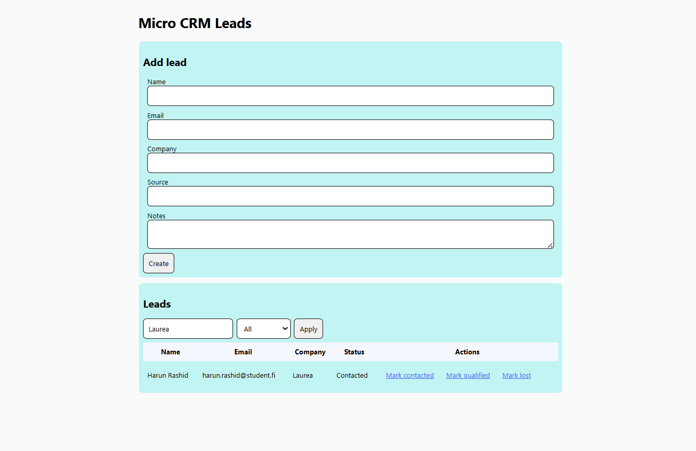
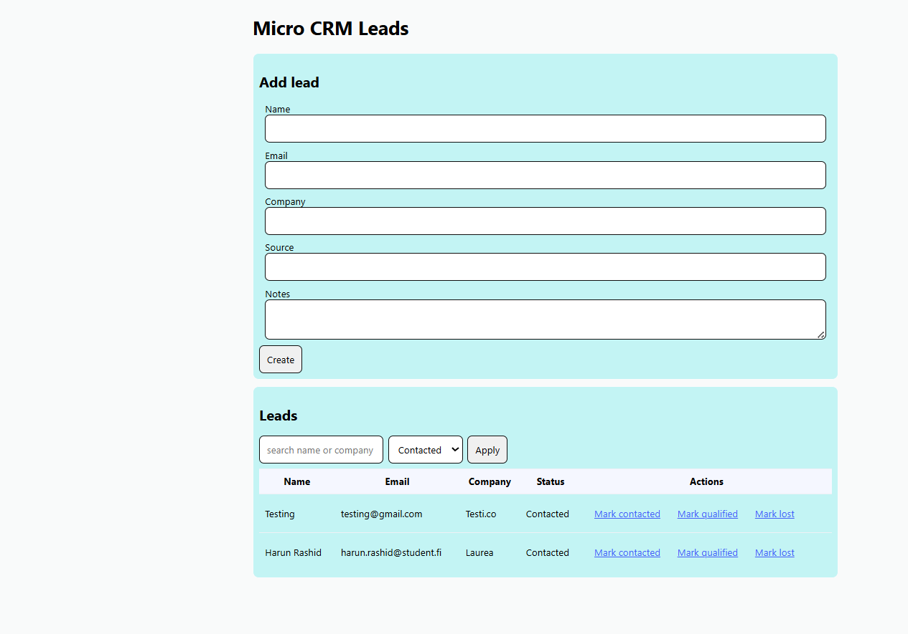
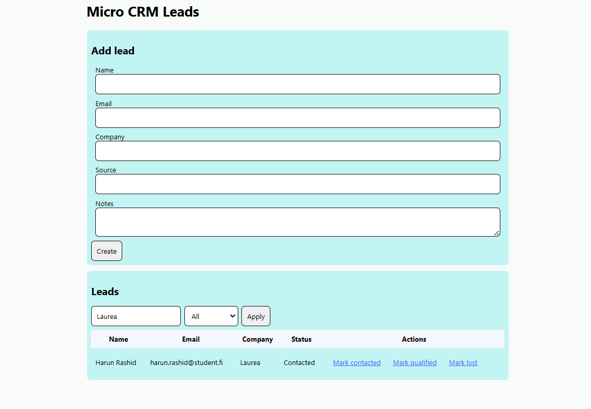
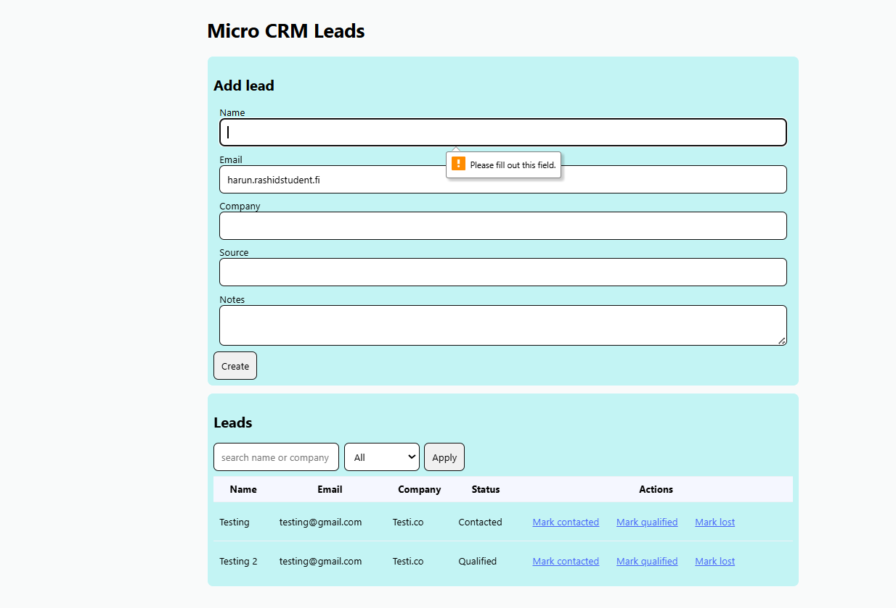

# 🧩 Micro CRM Leads Tracker

A lightweight full-stack web application for managing customer leads. Built with HTML, CSS, and JavaScript on the frontend, and Node.js with Express.js on the backend. It allows users to create, search, filter, and update lead information, with data stored in a simple JSON file.

## 📌 Main Features

- ✅ Create and list customer leads  
- 🔍 Filter leads by status and search by name or company  
- 🔄 Update lead status dynamically  


## 📁 Project Structure

```
project-name: Micro CRM Leads Tracker
├── public/               
│   ├── index.html        
│   ├── style.css         
│   ├── app.js            
├── images/                          
│   ├── HomePage.png       
│   ├── SearchLeadsByCompany.png
│   ├── FilterByLeadsType.png
│   ├── DataValidationNameRequired.png
│   ├── DataValidationAddressRequired.png
├── package-lock.js           
├── server.js             
├── leads.js              
├── .gitignore            
├── README.md             
└── package.json  
``` 
## 🛠️ Tools and Technologies

| Layer        | Technologies Used                  |
|--------------|------------------------------------|
| **Frontend** | HTML, CSS, JavaScript              |
| **Backend**  | Node.js, Express.js                |
| **Storage**  | JSON file for lightweight data persistence |


## 📷 Screenshots

### 1. 🏠 Home Page


### 2. 📋 Filter By Leads Type


### 3. 🔍 Search Leads By Company


### 4. 🔄 Data Validation Name Required


### 5. 📊 Data Validation Email Address Required 


## 🧠 Self Assessment and Reflection

This project helped me understand how full-stack development works. The Micro CRM Leads Tracker web application was built using frontend technologies such as **HTML**, **CSS**, and **JavaScript**, along with backend technologies like **Node.js** and **Express.js**. A **JSON** file is used for lightweight data storage.

In the HTML form, the `required` attribute prevents incomplete submissions, while the `type` attribute ensures browser-level validation for inputs like email.

I learned modern JavaScript features including `async/await`, `FormData`, and `Object.fromEntries`. I found the `async/await` feature crucial for this application, as it allows asynchronous functions to wait for server responses without freezing the entire program. The `FormData` feature collects form input efficiently, and `Object.fromEntries` converts that data into a usable JavaScript object.

Throughout the project, I developed a deeper understanding of how data flows from the frontend to the backend and how it is stored in the JSON file.

